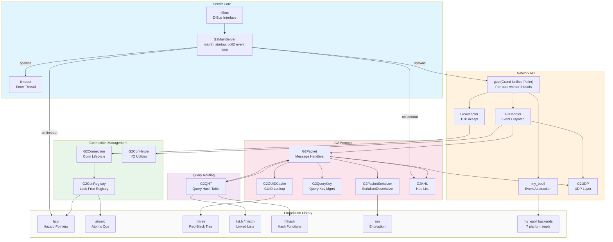

# G2CD Architecture

## Overview

**G2CD** is a server-only implementation of the **Gnutella 2** (G2) peer-to-peer protocol. It is designed to run as a dedicated **Hub** (Ultra-peer) on UNIX server-grade hardware, maintaining G2 network connectivity for connected Leaf nodes.

| Metric | Value |
|--------|-------|
| Language | C99 (with GCC extensions) |
| Source files | 393 |
| Indexed symbols | 5,884 |
| Relationships | 12,470 |
| Execution flows | 300 |
| Functional clusters | 467 |
| Build system | Autoconf + Make |

### Design Goals

- **C10k scalability** — Handle 10,000+ concurrent TCP connections
- **Lock-free concurrency** — Hazard pointer-based memory reclamation (no GC, no locking bottlenecks, no reference counting bottlenecks)
- **Cross-platform portability** — Runs on Linux, BSD; supports x86, ARM, PPC, SPARC, MIPS, RISC-V
- **Minimal per-connection state** — Connections allocate buffers on-demand rather than holding fixed buffers

## Functional Areas

### Server Core (`G2MainServer.*`)

Entry point, startup, primary event loop, signal handling, and global server state. The main thread runs a `poll()` loop (11-second timeout) over inter-thread communication sockets (`sock_com`), calling handlers for each active FD. On timeout it runs maintenance: `hzp_scan()` for lock-free memory reclamation, `g2_khl_tick()` for known-hub-list housekeeping, and `g2_qht_global_update()` for global query hash table updates.

The main thread also spawns the worker threads during `startup()`:
- `THREAD_GUP` — the Grand Unified Poller thread
- `THREAD_TIMER` — the timeout timer task

Signal handling for graceful shutdown (`SIGINT`, `SIGTERM`) and runtime dumps (`SIGUSR1`, `SIGUSR2`).

### Grand Unified Poller (`gup.*`)

Multi-threaded I/O poller that handles all network-facing work. The `gup()` entry function is spawned as a pthread from `G2MainServer.c`. It creates `get_cpus_online()` helper worker threads plus runs itself on thread 0 — so there is one worker thread per CPU core. Each worker:

- Runs `gup_loop()` which polls a shared epoll fd in a tight loop
- Initializes per-thread hazard pointers (`hzp_alloc()`), packet buffers, and receive buffers
- Handles TCP connection reads/writes, UDP routing, and connection acceptance
- Uses dynamic CPU pinning: under high wakeup rates (>50/sec) a worker pins to its own core; under low load it roams freely across all cores
- Communicates with the main thread via the `sock_com` pipe mechanism

### Connection Management (`G2Connection.*`, `G2ConRegistry.*`, `G2ConHelper.*`)

Manages the lifecycle of TCP connections to Leaf nodes and other Hubs:

- `g2_con_init()` / `g2_con_deinit()` — Connection allocation and teardown
- `G2ConRegistry` — low-lock connection registry and Master-QHT handling
  - `do_global_search()` / `do_global_search_chain()` — Cross-registry search operations
  - other helper finding connected leafs nodes
- `G2ConHelper` — I/O utilities: `do_writev()`, `recycle_con()`, `handle_socket_abnorm()`

### Acceptor (`G2Acceptor.*`)

Incoming TCP connection acceptor (runs inside GUP worker threads):

- `init_con_a()` — Initializes acceptor state
- `handle_accept_in()` — Accepts new connections, performs initial handshake validation
- `check_for_accept()` / `accept_timeout()` — Accept backpressure management

### I/O Event Handler (`G2Handler.*`)

Central dispatch from epoll events to protocol handlers:

- `handle_socket_io_h()` — High-priority socket I/O (reads with atomic buffer operations)
- `handle_con()` — Connection state machine dispatch

### Protocol Layer (`G2Packet.*`, `G2PacketSerializer.*`, `G2PacketTyper.*`)

G2 protocol message handling — the largest functional cluster (75 symbols). Incoming packets flow through:

```
epoll event (gup worker) → handle_socket_io_h → g2_packet_decode_from_packet → g2_packet_decode → type-specific handler
```

**Protocol message handlers** (all in `G2Packet.c`):

| Handler | Message Type | Purpose |
|---------|-------------|---------|
| `handle_Q2` / `handle_Q2_UDP` / `handle_Q2_QKY` | Q2 Query | File content search queries |
| `handle_QH2` | QH2 Query Heartbeat | Hub-to-hub query propagation |
| `handle_QA` / `handle_QA_S` | QA Query Answer | Search result responses |
| `handle_QKA` | QKA Known Hub Answer | Hub advertisement responses |
| `handle_QKR` | QKR Query Key Response | Query key validation |
| `handle_LNI` / `handle_LNI_HS` | LNI Leaf Network Info | Leaf connection info exchange |
| `handle_KHL` / `handle_KHLR` / `handle_KHL_NH` | KHL Known Hub List | Hub topology distribution |
| `handle_HAW` | HAW Hub Announce What | Hub capability announcement |
| `handle_PI` / `handle_PO` | PI/PO Ping/Pong | Keep-alive heartbeat |
| `handle_CRAWLR` | CRAWLR | Gnutella Web Cache crawler |
| `handle_QHT` | QHT Query Heartbeat Tick | Periodic heartbeat |
| `handle_Q2_URN` | Q2 URN | URN-based query handling |
| `handle_UPROC` | UPROC | Unprocessed message handler |

**Serialization** (`G2PacketSerializer.*`):
- `create_control_byte()` — G2 packet control byte construction
- `g2_packet_serialize_to_buff_p()` — Packet-to-buffer serialization
- `g2_packet_decode_from_packet()` — Buffer-to-packet deserialization

### Query Hash Table (`G2QHT.*`)

Core routing data structure for G2 query propagation:

- `qhtable` — 128 KB bloom filter; each connection maintains its own copy (the "heavy state" in C10k)
- `qht_fragment` — Network transport fragment: diffs between QHT versions, split for wire transfer
- `g2_qht_search_prepare()` / `g2_qht_search_number_word()` — Search preparation
- `g2_qht_global_search()` / `g2_qht_global_search_chain()` / `g2_qht_global_search_bucket()` — Global search across table
- `g2_qht_match_hubs()` / `g2_qht_match_leafs()` — Match queries to connected nodes
- `hub_match_callback()` — Callback invoked when query matches a connected node
- `g2_qht_global_update()` — Periodic global state updates (called from main thread)

### Query Key (`G2QueryKey.*`)

Query key generation, validation, and caching:

- `g2_qk_generate()` — Generate query keys for search requests
- `g2_qk_check()` — Validate incoming query keys
- `addr_hash_generate()` — Address-based hash generation
- `cache_ht_del()` / `cache_ht_hash()` — Query key cache operations

### GUID Cache (`G2GUIDCache.*`)

Gnutella node identity (GUID) caching and lookup:

- `g2_guid_lookup()` — Resolve GUIDs to node identities
- `guid_entry` / `rb_root` — Red-black tree based cache structure

### Known Hub List (`G2KHL.*`)

Maintenance of known Hubs for network bootstrapping and routing.

### UDP Layer (`G2UDP.*`)

UDP communication for G2 broadcast queries and responses:

- `g2_udp_send()` — UDP packet transmission
- `udp_writeout_packet()` / `udp_writeout_packet_c()` — UDP packet construction
- `packet_reasamble()` — UDP packet reassembly
- `g2_udp_reas_add()` / `g2_udp_reas_timeout()` — Reassembly state management
- BPF filter (`G2UDPPValid.bpf`) — Kernel-level packet filtering

### Timeout Management (`timeout.*`)

Timer and timeout infrastructure using red-black trees. Runs in a dedicated `THREAD_TIMER` pthread spawned from `G2MainServer.c`:

- `timeout_general_callback()` — Generic timeout dispatch
- `timeout_advance()` / `timeout_add()` / `timeout_timer_task()` — Timer operations
- `kick_timeouts()` — Periodic timeout check
- `bounce_from_timer()` — Timer-triggered event bounce (`G2MainServer.c`)

### D-Bus Interface (`idbus.*`)

Optional D-Bus integration for runtime monitoring:

- `message_handler()` — D-Bus message dispatch
- `dump_a_con()` — Connection state export

### Build-Time Utilities

These files contain `main()` functions but are **not** part of the runtime server:

| File | Purpose |
|------|---------|
| `ccdrv.c` | C Compiler Driver — build-time pretty-print helper |
| `G2PacketTyperGenerator.c` | Generates packet type mapping code at build time |
| `G2HeaderFieldsSort.c` | Sorts and generates header field tables at build time |
| `bin2o.c` | Converts raw binary data to object files at build time |
| `calltree.c` | Build-time call graph utility |
| `arflock.c` | Proxy lock for `ar` archiver — enables parallel `make` by serializing `.a` writes |
| `lib/five_tab_gen.c` | Generates five-table lookup data at build time |
| `lib/aes_tab_gen.c` | Generates AES lookup table data at build time |

## Foundation Library (`lib/`)

### Cross-Platform Primitives

| Module | Purpose |
|--------|---------|
| `atomic.*` | Pre-C11 atomic operations (portable CAS, LL/SC) |
| `hzp.*` | Hazard pointers for lock-free memory reclamation |
| `my_epoll.*` | Portable event notification (7 backend implementations) |
| `my_pthread.*` | pthread abstraction with DBM compatibility |
| `udpfromto.*` | Portable UDP send/recv with source and destination address capture (multihomed hosts) |
| `other.h` | Compiler compatibility layer (GCC attributes, barriers, inline control) |

### Architecture-Specific Optimizations

Directories `x86/`, `arm/`, `ppc/`, `sparc/`, `mips/`, `ia64/`, `alpha/`, `tile/`, `parisc/`, `riscv/`, `generic/` contain optimized implementations of:
- Atomic operations (CAS, fetch-add)
- Vectorized Adler32 checksums
- Unaligned memory access helpers
- Bit manipulation routines
- AES primitves

### Data Structures

| Module | Purpose |
|--------|---------|
| `list.h` | Doubly-linked list (Linux kernel style) |
| `hlist.h` | Headless hash list |
| `rbtree.*` / `rbtree_augmented.h` | Red-black tree with augmentation support |
| `hthash.*` | Hash table with MurmurHash/jhash |
| `palloc.*` | Pool allocator |
| `recv_buff.*` | Receive buffer management |
| `combo_addr.*` | IPv4/IPv6 combined storage and handling |

### Cryptography & Hashing

| Module | Purpose |
|--------|---------|
| `aes.*` | AES encryption (128/256-bit key schedules) |
| `hthash.*` | Hash table hashing (MurmurHash, jhash mix/final) |
| `adler32.*` | Vectorized Adler32 checksum |
| `ansi_prng.*` | ANSI random number generator |
| `guid.*` | GUID generation and manipulation |

### Utility

| Module | Purpose |
|--------|---------|
| `log_facility.*` | Logging infrastructure (`logg_pos`, `logg_posd`, `logg_errno`, `logg_packet`) |
| `config_parser.*` | Configuration file parser |
| `tchar.*` | Character classification and conversion tables |
| `backtrace.*` | Stack trace generation |
| Various `mem*.c` / `str*.c` | Portable memory and string operations |
| `bitfield_rle.c` | Run-length encoding for sparse bitfields, especially QHT bloom filter compression |
| `entities.c` | HTML named entity ↔ UTF-8 conversion funtions |
| `introsort.c` | Introsort for `uint32_t` arrays with duplicate removal — avoids qsort worst-case on crafted input |
| `inet_ntop.c` / `inet_pton.c` | Portable IPv4/IPv6 address string conversion (for systems lacking them) + extentions |
| `to_base16.c` / `to_base32.c` | Binary-to-hex and binary-to-base32 encoders with per-architecture SIMD paths |
| `itoa.h` | Header-only integer-to-string conversion with signed/unsigned and width-limited variants |
| `vsnprintf.c` | Portable and Extended `{v}snprintf`, but bare bones floating-point formatting |

## Key Execution Flows

### 1. Server Startup

```
main (G2MainServer.c)
  → startup (G2MainServer.c)
    → cpu_detect_finish
    → clutch_logfile — initialize logging
    → g2_con_init — initialize connection subsystem
      → g2_con_alloc → _g2_con_clear
      → INIT_LIST_HEAD, Atomic_set operations
    → my_epoll_create — create event loop
      → Hzp_deferfree, Vfcntl
    → handle_config — parse configuration
      → INIT_LIST_HEAD, List_add, List_entry
    → signal handler setup
    → set_master_time
    → pthread_create(THREAD_GUP, gup) — spawn multi-core poller
    → pthread_create(THREAD_TIMER, timeout_timer_task) — spawn timer thread
  → main event loop (poll on sock_com fds, ~11s timeout)
    → on events: dispatch to sock_com handlers
    → on timeout: hzp_scan, g2_khl_tick, g2_qht_global_update
```

### 2. Incoming TCP Connection

```
gup worker thread (gup.c)
  → handle_accept_in (G2Acceptor.c)
    → g2_con_init — allocate connection
    → handshake validation
    → handle_con (G2Handler.c) — dispatch to state machine
      → handle_con_a — active connection handling
        → My_epoll_recv, My_epoll_send
        → Buffer_flip, Logg_posd
```

### 3. G2 Packet Processing (e.g., Q2 Query)

```
gup worker thread (gup.c)
  → handle_socket_io_h (G2Handler.c)
    → Atomic_pread, Atomic_pxa — read from socket
    → handle_Q2_UDP (G2Packet.c)
      → skip_unexpected_child → skip_child — parse G2 tree structure
      → g2_packet_decode_from_packet (G2PacketSerializer.c)
        → g2_packet_decode
          → read_type_p — read packet type
          → g2_packet_find_type
            → find_type_outline_print
      → Logg_posd — log packet
```

### 4. Query Hash Table Search

```
handle_QH2 (G2Packet.c)
  → g2_guid_lookup (G2GUIDCache.c) — validate sender GUID
    → cache_ht_hash — compute cache hash
      → MMHASH_MIX, __jhash_mix — hash computation
  → Combo_addr_hash — compute address hash
  → Hlist_for_each_entry — iterate hash bucket
    → hub_match_callback (G2QHT.c)
      → g2_packet_hub_qht_done — finalize match
      → Atomic_set, Buffer_clear, List operations
```

### 5. Connection Cleanup (Lock-Free)

```
g2_con_deinit (G2Connection.c)
  → g2_conreg_remove (G2ConRegistry.c)
    → __hlist_del — remove from registry
    → Hzp_deferfree — schedule lock-free deferred free
g2_conreg_cleanup (G2ConRegistry.c)
  → Hzp_deferfree — process deferred frees
  → Atomic_read — check reference state
  → __hlist_del — finalize removal
```

## Architecture Diagram



## Thread Model

```
Main Thread (G2MainServer.c)
  └── poll() loop on sock_com FDs
      ├── hzp_scan() on timeout — lock-free memory reclamation
      ├── g2_khl_tick() on timeout — hub list maintenance
      └── g2_qht_global_update() on timeout — query table updates

GUP Thread (gup.c, thread 0)
  └── gup_loop() — epoll poller, handles TCP/UDP I/O

GUP Helper Threads (gup.c, threads 1..N, N = get_cpus_online())
  └── gup_loop() — epoll poller, handles TCP/UDP I/O
      └── Dynamic CPU pinning (high load → pinned, low load → roaming)

Timer Thread (timeout.c)
  └── timeout_timer_task() — manages timer rbtree, fires timeouts
```

## Concurrency Model

G2CD uses a **leader/worker** thread model with **lock-free shared data structures**:

1. **Main thread** — Orchestrates startup, runs a `poll()` loop for inter-thread communication, performs periodic maintenance (HZP scan, KHL tick, QHT update).

2. **GUP worker threads** (1 per CPU core) — Handle all network I/O: TCP accept, TCP read/write, UDP send/receive. Share a single epoll fd. Each worker initializes its own hazard pointer set and per-thread buffers.

3. **Timer thread** — Dedicated thread for timeout management.

4. **Hazard Pointers** (`lib/hzp.c`) — The primary mechanism for safe memory reclamation in lock-free data structures. The `hzp_scan()` function is highly optimized lock-free logic. Users interact via `hzp_ref`/`hzp_unref`/`hzp_deferfree` API only.

5. **Custom Atomic Operations** (`lib/atomic.c`) — Pre-C11 portable atomic library supporting multiple architectures. Key types: `atomic_t`, `atomicptr_t`, `atomicst_t`, `atomicptra_t`. Uses `atomic_cmpx`/`atomic_cmppx` for CAS operations.

6. **Pthread RW Locks** — Used for write-heavy sections of the connection registry where hazard pointers alone are insufficient.

7. **Per-thread buffers** — Connections allocate I/O buffers on-demand, reducing per-connection memory overhead.

## Performance Considerations

- **Per-connection QHT bloom filters** — Each connection holds its own 128 KB QHT bloom filter. This is the "heavy state" in C10k. Fragments (`qht_fragment`) carry incremental diffs over the wire rather than full tables.
- **Buffers are shared and recycled** — I/O buffers are pooled and recycled, not allocated per-connection
- **Hash table fragmentation** — `qht_fragment` allows memory-efficient large hash tables
- **Vectorized checksums** — Adler32 uses SIMD instructions (SSE2, NEON, VSX, VIS) per architecture
- **Kernel BPF filtering** — UDP packets are filtered in-kernel via `G2UDPPValid.bpf`
- **Dynamic CPU pinning** — GUP workers automatically pin to cores under high load and roam under low load
- **Branch prediction hints** — `likely()`/`unlikely()` macros used in CAS loops and hot paths
